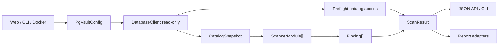

# PgVault

PgVault es un auditor read-only para PostgreSQL. Se conecta a una base de
datos, extrae metadata del catalogo, ejecuta modulos de analisis y entrega
hallazgos con severidad, evidencia agregada, recomendaciones, SQL sugerido y
referencias regulatorias.

El proyecto esta preparado para ejecutarse con Docker Compose e incluye una
interfaz web, una CLI JSON, bases demo de PostgreSQL y generadores de reporte
PDF.

## Capacidades Principales

- Conexion read-only a PostgreSQL mediante `asyncpg`.
- Guardia de aplicacion que bloquea sentencias de escritura.
- Preflight de acceso a fuentes de catalogo.
- Snapshot normalizado de schemas, tablas, columnas, roles, funciones,
  extensiones, settings, privilegios, reglas HBA y RLS.
- Deteccion de datos sensibles por nombre de columna y sampling controlado.
- Auditoria de configuracion, roles, privilegios, autenticacion y logging.
- API FastAPI e interfaz web para validar conexiones y ejecutar revisiones.
- CLI que usa el mismo orquestador que la web.
- Adaptadores para generar reportes ejecutivo y tecnico en PDF.
- Bases demo con datos sinteticos para validacion y demostracion.

## Inicio Rapido

Requisitos:

- Docker
- Docker Compose

Levantar PgVault y las bases demo:

```bash
docker compose up --build
```

Abrir la web:

```text
http://localhost:8000
```

Ejecutar el scanner por CLI dentro del contenedor:

```bash
docker compose run --rm pgvault python -m pgvault scan
```

Ejecutar pruebas:

```bash
docker compose run --rm --no-deps pgvault python -m pytest -q
```

## Bases Demo

Docker Compose levanta tres bases PostgreSQL de demostracion:

| Base | Host desde PgVault | Puerto interno | Puerto local | Usuario | Password |
|---|---|---:|---:|---|---|
| FintechDB | `fintechdb` | `5432` | `5433` | `fintech_user` | `fintech_pass` |
| TiendaDB | `tiendadb` | `5432` | `5432` | `tienda_user` | `tienda_pass` |
| AppDB | `appdb` | `5432` | `5434` | `app_user` | `app_pass` |

Cuando PgVault corre dentro de Docker, el host debe ser el nombre del servicio
(`fintechdb`, `tiendadb` o `appdb`), no `localhost`.

## Arquitectura

PgVault tiene un flujo unico para web, CLI, Docker y reportes:



Componentes principales:

- `pgvault/config.py`: configuracion por variables de entorno o payload web.
- `pgvault/db.py`: conexion PostgreSQL y guardia read-only.
- `pgvault/snapshot.py`: extraccion de metadata del catalogo.
- `pgvault/models.py`: contratos Pydantic compartidos.
- `pgvault/modules.py`: protocolo de modulos de escaneo.
- `pgvault/orchestrator.py`: flujo principal del scan.
- `pgvault/web.py`: API FastAPI e interfaz web.
- `pgvault/cli.py`: entrada por linea de comandos.
- `modules/pii_scanner/`: scanner de datos sensibles.
- `pgvault/scanners/configuration_scanner.py`: scanner de configuracion.
- `Reports/`: generacion de PDF ejecutivo y tecnico.

## Flujo De Datos

1. La web o CLI construye un `PgVaultConfig`.
2. `DatabaseClient` abre una conexion PostgreSQL con timeout configurado.
3. Cada consulta pasa por la guardia read-only.
4. `preflight_catalog_access` verifica que el usuario pueda leer fuentes de
   catalogo importantes.
5. `extract_catalog_snapshot` crea un `CatalogSnapshot` con metadata
   normalizada.
6. `run_scan` crea un `ScanContext` y ejecuta los modulos registrados.
7. Cada modulo devuelve una lista de `Finding`.
8. Si un modulo falla, el scan continua y el error queda en `ScanResult.errors`.
9. El resultado final se devuelve como `ScanResult`.

## Seguridad Read-Only

PgVault esta disenado para auditar sin modificar datos.

La guardia de aplicacion permite:

- `SELECT`
- `WITH`
- `SHOW`
- `EXPLAIN`

Y bloquea, entre otras:

- `INSERT`, `UPDATE`, `DELETE`, `MERGE`
- `CREATE`, `ALTER`, `DROP`, `TRUNCATE`
- `GRANT`, `REVOKE`
- `CALL`, `DO`, `COPY`
- multiples sentencias en una misma consulta
- `EXPLAIN ANALYZE`
- CTEs que modifican datos

Esta guardia reduce el riesgo operativo, pero no reemplaza una configuracion
real de permisos. En ambientes productivos se recomienda usar un usuario de
PostgreSQL con privilegios estrictamente read-only.

## Modulos De Escaneo

### PiiScanner

Detecta columnas que podrian contener datos personales, financieros o secretos.
Combina:

- patrones por nombre de columna (`email`, `curp`, `rfc`, `cvv`, `pan`,
  `password`, `token`, `clabe`, telefono, fecha de nacimiento, nombre completo);
- sampling read-only limitado por `PGVAULT_SAMPLE_LIMIT`;
- validadores de contenido;
- score de confianza y severidad.

La evidencia no incluye valores crudos de la base. Solo reporta datos
agregados como cantidad de filas muestreadas, ratio de coincidencia y
breakdown del score.

### ConfigurationScanner

Audita postura de seguridad y cumplimiento en PostgreSQL:

| ID | Control | Severidad |
|---|---|---|
| `CFG-001` | Roles con `SUPERUSER` innecesario | HIGH |
| `CFG-002` | Funciones `SECURITY DEFINER` que requieren revision de `search_path` | MEDIUM |
| `CFG-003` | `log_connections = off` | HIGH |
| `CFG-004` | `log_disconnections = off` | MEDIUM |
| `CFG-005` | Autenticacion `trust` en `pg_hba.conf` | CRITICAL/HIGH |
| `CFG-006` | Roles con nombres asociados a credenciales debiles | HIGH |
| `CFG-007` | Extensiones de riesgo instaladas | MEDIUM |
| `CFG-008` | Roles con login sin password, cuando `pg_authid` es accesible | HIGH |
| `CFG-009` | `archive_mode = off` | HIGH |
| `CFG-010` | SELECT sobre tablas de alcance PCI | CRITICAL |
| `CFG-011` | SELECT otorgado a `PUBLIC` | HIGH |

## API Web

Endpoints principales:

```text
GET  /api/health
POST /api/validate
POST /api/scans
```

La web guarda perfiles e historial solo en `localStorage` del navegador. La
contrasena se usa para conectar durante la sesion y no se persiste en backend.

## Configuracion

Variables soportadas:

| Variable | Uso |
|---|---|
| `PGHOST` | Host PostgreSQL |
| `PGPORT` | Puerto PostgreSQL |
| `PGDATABASE` | Base de datos |
| `PGUSER` | Usuario |
| `PGPASSWORD` | Password |
| `PGSSLMODE` | `disable`, `allow`, `prefer`, `require`, `verify-ca`, `verify-full` |
| `DATABASE_URL` | DSN opcional con prioridad sobre variables separadas |
| `PGVAULT_SAMPLE_LIMIT` | Limite de sampling para contenido PII |
| `PGVAULT_QUERY_TIMEOUT_SECONDS` | Timeout por consulta |
| `PGVAULT_WEB_DB` | Ruta opcional para almacenamiento web SQLite |

Usar `.env.example` como referencia para ejecucion local.

## Reportes

El nucleo de escaneo devuelve `ScanResult`. Para reportes PDF, convertir los
hallazgos con:

```python
from Reports.adapters import scan_result_to_report_findings
from Reports.generator import generate_all

findings = scan_result_to_report_findings(result)
generate_all(findings)
```

Esto genera reporte ejecutivo y tecnico en la carpeta `output/`.

## Documentacion

- [Guia tecnica](docs/BASE.md)
- [Uso de demos y validacion](docs/USO_DEMOS.md)
- [Roles del equipo](docs/ROLES.md)
- [Reglas de Git](docs/REGLAS_GIT.md)
- [Control del proyecto](docs/CONTROL_GITHUB_PROJECTS.md)
- [Documento de negocio](business/Documento%20de%20Negocio%20-%20PgVault.md)
- [Pitch](business/Pitch-Guion.md)

## Equipo

| Rol | Responsable |
|---|---|
| Conector y orquestador | Diego Vega |
| Auditor de configuracion | Dowshell Smith |
| Descubridor de datos sensibles | Daniela Borquez |
| Reportes y mapeo regulatorio | Mariajose Rito |
| Producto, negocio y coordinacion | Cesar Mendez |

Integrantes:

- Borquez Hernandez, Daniela
- Mc Donald Smith, Dowshel Jekeal
- Mendez Yepez, Cesar Alejandro
- Rito Michelena, Mariajose
- Vega Cabrera, Diego
