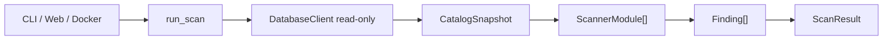

# PgVault

PgVault es un auditor de seguridad y cumplimiento para PostgreSQL. Se conecta
en modo read-only, analiza configuracion, privilegios y datos sensibles, y
produce hallazgos con evidencia agregada y recomendaciones accionables.

## Equipo

Integrantes del equipo:

- Borquez Hernandez, Daniela
- Mc Donald Smith, Dowshel Jekeal
- Mendez Yepez, Cesar Alejandro
- Rito Michelena, Mariajose
- Vega Cabrera, Diego

| Integrante | Rol principal | Nombre |
|---|---|---|
| Integrante 1 | Conector y orquestador | Diego Vega |
| Integrante 2 | Auditor de configuracion | Dowshell Smith |
| Integrante 3 | Descubridor de datos sensibles | Daniela Borquez |
| Integrante 4 | Reportes y mapeo regulatorio | Mariajose Rito |
| Integrante 5 | Producto, negocio y coordinacion | Cesar Mendez |

## Objetivo

El proyecto busca entregar un MVP capaz de ejecutar una revision reproducible
de bases PostgreSQL sin modificar datos. La salida debe ser entendible para
usuarios tecnicos y no tecnicos: severidad, evidencia, recomendacion,
referencias regulatorias y reportes.

## Alcance del MVP

- Conexion read-only a PostgreSQL.
- Extraccion de informacion del catalogo.
- Checks de seguridad y configuracion.
- Deteccion de datos sensibles por nombre y contenido.
- Recomendaciones automaticas por hallazgo detectado.
- Interfaz web para validar conexion y ejecutar revisiones.
- Reporte ejecutivo y tecnico.
- Exportacion a PDF.
- Ejecucion con Docker Compose.

## Ejecucion rapida

El proyecto esta preparado para ejecutarse con Docker Compose:

```bash
docker compose up --build
```

La interfaz web queda disponible en:

```text
http://localhost:8000
```

El CLI usa el mismo orquestador que la web:

```bash
docker compose run --rm pgvault python -m pgvault scan
```

## Documentos utiles

- [Guia base tecnica](docs/BASE.md)
- [Uso, demos y validacion](docs/USO_DEMOS.md)
- [GitHub Projects](docs/CONTROL_GITHUB_PROJECTS.md)
- [Reglas de Git](docs/REGLAS_GIT.md)
- [Roles](docs/ROLES.md)
- [Documento de negocio](docs/Documento%20de%20Negocio%20-%20PgVault.md)

## Arquitectura general

PgVault tiene un flujo unico para CLI, web, Docker y reportes:



Los detalles del contrato tecnico, modelos, snapshot, guardia read-only y forma
de crear modulos estan documentados en [docs/BASE.md](docs/BASE.md).

## Entregas

- **9 de mayo:** base inicial, roles, tablero, primeras tareas y avance tecnico inicial.
- **12 de mayo:** demo parcial con integracion y al menos 8 hallazgos funcionando.
- **15 de mayo:** MVP final, Docker Compose, reportes, pitch, video demo y Q&A.

## Flujo de trabajo

1. Crear o tomar una Issue del GitHub Project.
2. Crear rama propia.
3. Hacer commits claros.
4. Abrir Pull Request.
5. Pedir revision cruzada.
6. Hacer merge solo cuando el PR este aprobado.

Estados del Project:

- Todo
- In Progress
- In Review
- Done

## Uso de IA

Se puede usar IA para apoyo, investigacion, documentacion, revision o ideas
tecnicas. Cualquier uso relevante debe declararse en el Pull Request.
