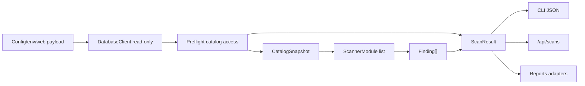

# Guia base

Esta guia resume la base tecnica compartida de PgVault. Sirve como referencia
global para entender la configuracion, el conector read-only, el snapshot de
catalogo, los modelos compartidos y la forma en que se conectan los modulos.

## Alcance

La base contiene:

- Configuracion por variables de entorno en `pgvault/config.py`.
- Cliente PostgreSQL con guardia read-only en `pgvault/db.py`.
- Preflight de acceso a catalogos y snapshot en `pgvault/snapshot.py`.
- Modelos compartidos en `pgvault/models.py`.
- Interfaz de modulos en `pgvault/modules.py`.
- Orquestador principal en `pgvault/orchestrator.py`.
- CLI JSON en `pgvault/cli.py`.
- Dockerfile y Docker Compose para ejecutar el proyecto de forma consistente.

La base no contiene los checks finales de configuracion/privilegios ni el PDF
profesional, pero si incluye un primer modulo real de PII por nombre y sampling
seguro para probar el flujo end-to-end sin hardcodear problemas de FintechDB.

## Estructura

```text
pgvault/
  config.py        Configuracion desde entorno.
  db.py            Conexion asyncpg y guardia read-only.
  models.py        Contratos Pydantic compartidos.
  snapshot.py      Preflight y extraccion del catalogo.
  modules.py       Interfaz para scanners.
  orchestrator.py  Flujo principal del scan.
  cli.py           Entrada por linea de comandos.
  web.py           API FastAPI que usa el mismo orquestador.

modules/
  pii_scanner/     Scanner PII conectado a ScannerModule.

tests/
  test_base_architecture.py
  test_demo_databases.py
```

## Uso con Docker Compose

La forma principal de ejecutar PgVault es con Docker Compose. El contenedor de
la aplicacion instala las dependencias del proyecto y se conecta al servicio de
PostgreSQL definido en `docker-compose.yml`.

Levantar PostgreSQL y ejecutar PgVault:

```bash
docker compose up --build
```

El compose principal levanta la web de PgVault y las bases demo `fintechdb`,
`tiendadb` y `appdb`. El servicio `pgvault` corre Uvicorn; el CLI queda
disponible dentro del mismo contenedor.

Ejecutar CLI contra la configuracion del contenedor:

```bash
docker compose run --rm pgvault python -m pgvault scan
```

## Validacion con Docker

Validar la configuracion de Compose:

```bash
docker compose config
```

Construir la imagen de PgVault:

```bash
docker compose build pgvault
```

Ejecutar pruebas dentro del contenedor:

```bash
docker compose run --rm --no-deps pgvault python -m pytest -q
```

No es necesario instalar Python, pip ni pytest directamente en la maquina
local para usar o validar el proyecto.

## Variables de entorno

PgVault lee estas variables:

- `PGHOST`
- `PGPORT`
- `PGDATABASE`
- `PGUSER`
- `PGPASSWORD`
- `PGSSLMODE`
- `DATABASE_URL` opcional, con prioridad sobre las variables separadas.
- `PGVAULT_SAMPLE_LIMIT`
- `PGVAULT_QUERY_TIMEOUT_SECONDS`

Usar `.env.example` como plantilla para crear un `.env` local.

## Flujo del orquestador

El flujo principal es:

1. Cargar configuracion.
2. Conectar a PostgreSQL con asyncpg.
3. Ejecutar preflight de fuentes de catalogo.
4. Extraer `CatalogSnapshot`.
5. Ejecutar los modulos registrados.
6. Unificar findings.
7. Capturar warnings y errores por modulo.
8. Devolver `ScanResult`.

Si un modulo falla, el scan continua y el error queda registrado en
`ScanResult.errors`.

## Contrato de modelos

Los modulos deben importar modelos desde `pgvault.models`.

El modelo central para hallazgos es `Finding`. Es generico para PII,
configuracion, privilegios y futuros reportes. Incluye:

- Identificacion: `id`, `module`, `category`.
- Texto para reporte: `title`, `description`, `evidence`, `recommendation`.
- Riesgo: `severity`, `confidence_score`.
- Ubicacion opcional: `table_schema`, `table_name`, `column_name`.
- Cumplimiento: `regulation_refs`.
- Extensiones futuras: `metadata`.

El snapshot de catalogo se representa con `CatalogSnapshot` e incluye schemas,
tablas, columnas, roles, membresias, funciones, extensiones, settings, reglas
HBA, privilegios visibles, metadata RLS y estimaciones de filas cuando estan
disponibles. No lee datos reales de tablas.

## Guardia read-only

`DatabaseClient` permite consultas que empiezan con:

- `SELECT`
- `WITH`
- `SHOW`
- `EXPLAIN`

Bloquea sentencias peligrosas como `INSERT`, `UPDATE`, `DELETE`, `DROP`,
`ALTER`, `CREATE`, `TRUNCATE`, `GRANT`, `REVOKE`, `CALL`, `DO` y `COPY`.
Tambien bloquea multiples sentencias, CTEs que modifican datos y
`EXPLAIN ANALYZE`.

Esta guardia es una defensa de aplicacion. No reemplaza usar un usuario real
de PostgreSQL con permisos read-only.

## Como conectar un modulo

Un modulo debe tener atributo `name` y metodo async `run`:

```python
from pgvault.models import Finding
from pgvault.modules import ScanContext


class MyScanner:
    name = "my_scanner"

    async def run(self, context: ScanContext) -> list[Finding]:
        return []
```

El modulo se registra pasandolo al orquestador:

```python
from pgvault.orchestrator import run_scan

result = await run_scan(modules=[MyScanner()])
```

Cada modulo recibe `ScanContext`, que contiene `config`, `db`, `snapshot`,
`scan_id` y `warnings`.

Los modulos por defecto se declaran en `get_default_modules()`. Actualmente
incluye `PiiScanner`, por lo que CLI, web y Docker ejecutan el mismo flujo real.



## Modelos del PII scanner existente

El scanner PII existente usa el contrato compartido de `pgvault.models`.
`modules/pii_scanner/models.py` funciona como archivo de compatibilidad para
imports anteriores.

El archivo raiz `models.py` tambien funciona como re-export temporal de
`pgvault.models` para reducir rupturas con imports antiguos.

## Guia por integrante

- Integrante 2 debe crear scanners que lean `context.snapshot.settings`,
  `roles`, `role_memberships`, `functions`, `extensions`, `privileges`, `rls`,
  `schemas` y `tables`; solo debe consultar `context.db` si el snapshot no
  basta.
- Integrante 3 debe extender `modules/pii_scanner` con mejores validadores y
  heuristicas de contenido. La evidencia debe seguir siendo agregada: conteos,
  ratios y metadata, nunca valores crudos.
- Integrante 4 debe consumir `ScanResult.findings`. Para el codigo legacy de
  `Reports/`, usar `Reports.adapters.scan_result_to_report_findings`.
- Integrante 5 puede usar CLI, web y Docker sin rutas especiales: todos llaman
  `pgvault.orchestrator.run_scan`.
